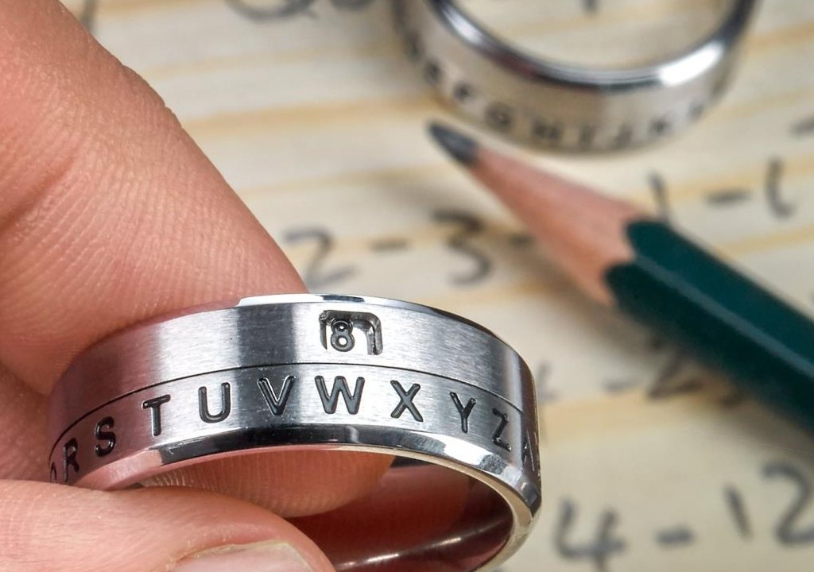

These simple scripts allow you to quickly encode and decode messages compatible with the [decoder rings from Lee Valley](https://www.leevalley.com/en-us/shop/home/toys-and-games/toys/110774-secret-decoder-rings). Such rings are also available [elsewhere](https://www.amazon.com/Decoder-Ring-Secret-Window-Silver/dp/B006IVX7TG) though you may need to adjust the lookup table. I made these to quickly generate puzzles for the kids, which gave them hours of practice. These rings give a very fun introduction to cryptography, and the inherent weaknesses of simple substitution ciphers. The kids quickly observed the obvious patterns of the plaintext english language inputs appearing in the output, and after a short time were able to decode significant portions from memory alone.

Usage is as follows to encode a string:

    decoder_ring$ ./encode.py "hello world"
     input = HELLO WORLD
     output =
     24 - 6 - 14 - 14 - 3
     18 - 3 - 17 - 14 - 9

And to decode:

    decoder_ring$ ./decode.py "24 - 6 - 14 - 14 - 3 - 18 - 3 - 17 - 14 - 9"
     input = ['24', '6', '14', '14', '3', '18', '3', '17', '14', '9']
     output = HELLOWORLD

An astute reader also recommended <https://www.boxentriq.com/code-breaking/a1z26>
with the alphabet set to "`IZOACEBFDGPMNLKQRWVXUYSHJT`" as a convenient
alternative.
